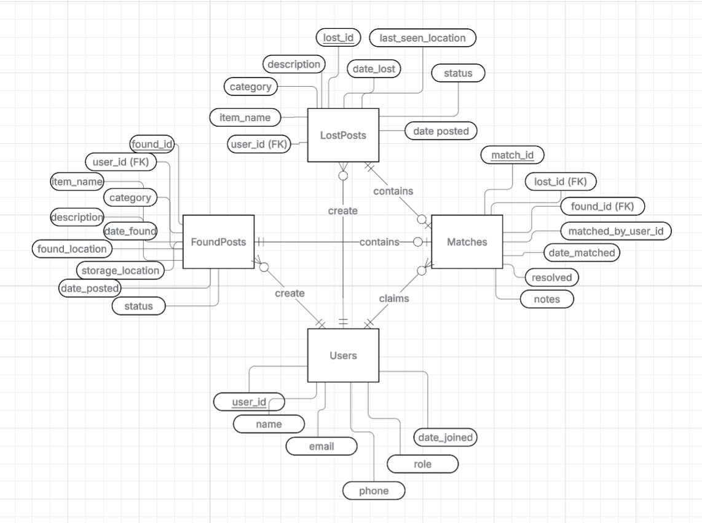

# CS 2500 – Final Project
## Cale Ellingson, Kalei Foley-Rutherfurd

### Project Overview
This is a lost and found website to report lost (or found) items that will be stored 
in a database. It works through a website interface that uses input boxes that fill 
in the data.

### Database Description
The database is made up of 4 tables: FoundPosts, LostPosts, Matches, and Users.
It follows this schema:

FoundPosts(**found_id**, _user_id_, item_name, category, description, date_found, found_location, storage_location, date_posted, status)

LostPosts(**lost_id**, _user_id_, item_name, category, description, date_lost, last_seen_location, date_posted, status)

Matches(**match_id**, _lost_id_, _found_id_, matched_by_user_id, date_matched, resolved, notes)

Users(**user_id**, name, email, phone, role, date_joined)

The ER-Diagram can be seen below:

### Code Description

Download required libraries via terminal

    pip install -r requirements.txt

Run the program via terminal 
    
    fastapi dev main.py

### ai usage
I started this project by planning out a lost and found database with 
four main tables: Users, LostPosts, FoundPosts, and Matches. 
Once I had the basic idea down, I talked through some concepts with 
ChatGPT to figure out what kinds of functions I'd need in my db.py 
file, like functions to add lost posts, get found items, and 
match things together - but this was just brainstorming ideas, 
not writing any actual code. After that, I wrote all the CREATE 
statements myself using what I learned from previous assignments and 
looking stuff up on W3Schools and other sites. I tested everything out 
by manually creating a few INSERT statements with one user, one lost 
item, one found item, and one match to make sure it all worked. Once I 
knew the database was solid, I had ChatGPT generate a bunch of sample 
data for me - around 20-30 lost and found items, 20 users, and a few 
matches - because manually typing all that out would've taken forever. 
I built the database functions in db.py on my own, but then 
I used Claude and Gemini to help me create the HTML templates and set 
up the FastAPI routes in main.py, along with the forms and user 
interface stuff. Basically, I did the database design and logic myself, 
but AI really helped speed up building the web pages and gave me 
realistic test data to work with.

###

